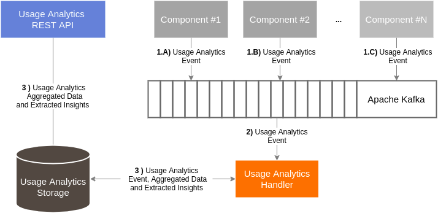

# ICARUS Usage Analytics API Module
## Overview
The ICARUS Usage Analytics API Module is a containerized service that aims to provide meaningful insights by visualizing utilization statistics about the usage of data assets, service assets and the ICARUS platform. Specifically, Usage Analytics provides the mechanisms to collect, store, aggregate and visualise this information.

## Architecture
In terms of design, the Usage Analytics utilize a publish-subscribe pattern and is composed of the following subcomponents:
* The **Usage Analytics Queue**, which is a high-performance queuing service (Apache Kafka) that receives and manages the utilization events that were published from several components.
* The **Usage Analytics Storage**, which is responsible for storing platform's historical utilization data.
* The **Usage Analytics Handler** consumes the utilization events and stores them in the ICARUS storage.
* The **Usage Analytics API** is a REST API that provides the stored aggregated utilization data to the platform's users.

	

