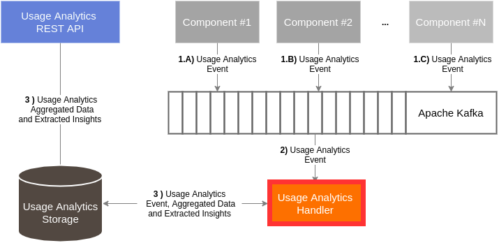

# ICARUS Usage Analytics Handler
## Overview
The ICARUS Usage Analytics Handler is a containerized service that  consumes the utilization events and stores them in the ICARUS storage. 

## Install
The whole service runs in the container, and the user needs first to compile the maven project and then run the appropriate docker commands.

### Maven build
```
mvn clean install package -Denvironment=prod -DskipTests
```

### Docker build
```
docker build -t usage_analytics_handler .
```

### Docker run
```
docker run -d --rm --name usage_analytics_handler usage_analytics_handler
```

### Docker stop
```
docker stop usage_analytics_handler
```

## Architecture
The Usage Analytics Handler works as a kafka consumer module that connects also with a postgres database. The handler (i) consumes the utilization events that were published on a specific topic, (ii) checks whether the event is valid, (iii) makes the appropriate aggregations and then (iv) it stores the events into the database.
<div align="center">
	
</div>